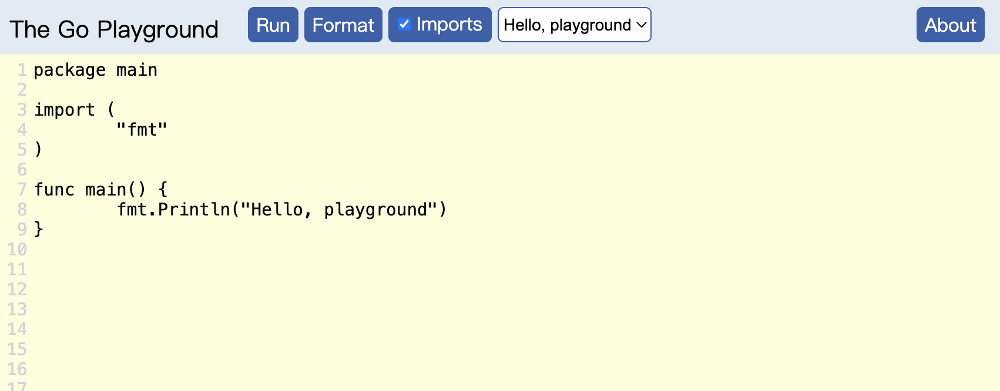

# Golang 游乐场 (Go Playground)

基于 [Golang 官方项目](https://github.com/golang/playground)调整而来，让你可以在本地快速启动一套 Golang Web Playground，来快速验证各种 Golang 代码片段。



## 项目特点

- 支持完全离线运行，无需“联网”，不需担心有任何信息泄漏的风险（比如包含密钥的程序）。
- 支持使用容器进行快速启动，不锁定任何公有云或者复杂的运行环境。
- 和官方程序一样，使用沙盒方式运行 Golang 程序，确保运行程序安全，无副作用。
- 和官方程序一样，使用 `faketime` “模块”，让程序能够提供确定性的输出，让程序复现和结果缓存变的更加容易。
- 合并了来自 `go.dev` 的默认示例，并进行了适当的界面“汉化”。
- 大幅精简程序模块和依赖，减少不必要的资源消耗。

## 快速开始

想要运行程序，**首先**需要先安装 Docker，桌面操作系统可以访问官网[下载安装文件](https://www.docker.com/get-started/)，服务器版本的 Docker 安装，可以[参考这里](https://soulteary.com/2022/06/21/building-a-cost-effective-linux-learning-environment-on-a-laptop-the-basics.html#%E6%9B%B4%E7%AE%80%E5%8D%95%E7%9A%84-docker-%E5%AE%89%E8%A3%85)。

**然后**，执行下面的命令或者项目中的程序（`bash pull-images.sh`），获取必要的镜像文件：

```bash
docker pull soulteary/golang-playground:web-1.23.4
docker pull soulteary/golang-playground:sandbox-1.23.4
docker pull soulteary/golang-playground:actuator-1.23.4
docker pull memcached:1.6.15-alpine
```

**接着**，在镜像获取完毕之后，使用 `docker-compose up -d` 或 `docker compose up -d`，启动程序。

**最后**，打开浏览器，访问 `http://localhost:8080`，就可以开始 Golang 之旅啦。

## 构建镜像

如果你希望进行二次开发，或者“自己动手”从零构建这套程序，可以执行项目目录中的程序（`bash make-images.sh`），程序会自动构建运行所需要的各种镜像。

```bash
# bash make-images.sh
Sending build context to Docker daemon  1.349MB
Step 1/30 : ARG GO_VERSION=1.23.4
Step 2/30 : FROM golang:${GO_VERSION}-alpine3.21 AS build-playground
 ---> 5e999c13ceac
Step 3/30 : LABEL maintainer="soulteary@gmail.com"
 ---> Using cache
 ---> a253b22ef53a
...
Successfully built 37e124ce9e7f
Successfully tagged soulteary/golang-playground:web-1.23.4
...
Successfully built 6017738b85ce
Successfully tagged soulteary/golang-playground:sandbox-1.23.4
Step 1/24 : ARG GO_VERSION=1.23.4
Step 2/24 : FROM golang:${GO_VERSION}-alpine3.21 AS build-sandbox
...
Successfully built c51b8a6647fb
Successfully tagged soulteary/golang-playground:actuator-1.23.4
```

